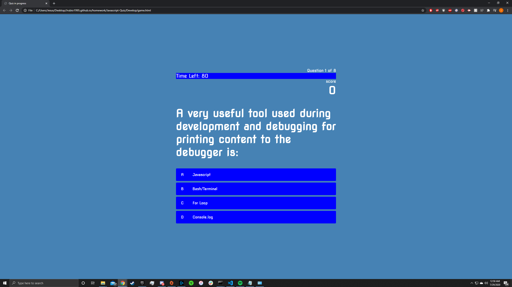

In this activity you learn how to set up a Mini game. This quiz could be achieved with at least two html files one for the quiz and another for the scoreboard. This quiz has 8 questions about javascript. Each time you answer the question correctly you'll receive 100 points and if wrong the timer will speed up. Each page has a different title different title on the browser tab.
